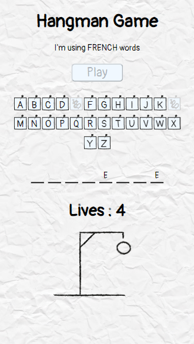
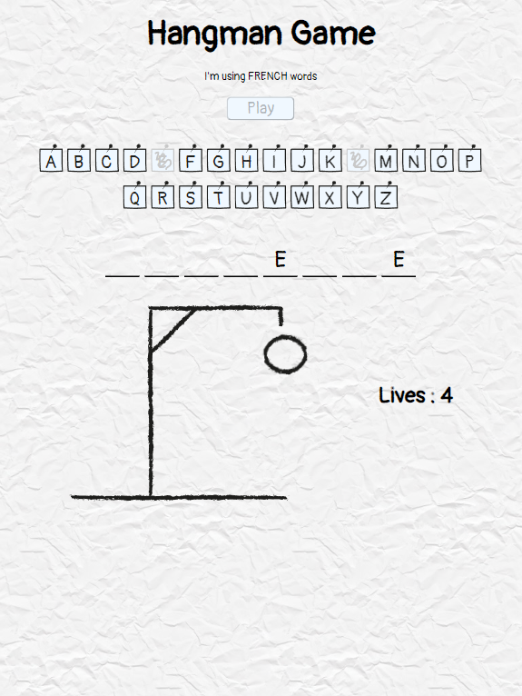
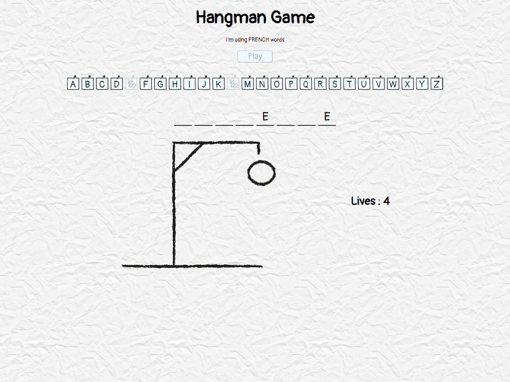

# HangmanGame

HangmanGame is a project to recreate the famous word game "Hangman" in which you have to found a word by guessing letters.
If you found all the letters of the word you win, if you take too much attemps you lose.

## The mission

You have to make a website version of the *hangman* word game. To do so
try to think the *structure*, the *backend* (functionality) and the *frontend*
(design) of your project before you start coding.

At the very least your version of the *hangman* should:

* propose an hidden word 
* allow the selection of letters
* verify if a selected letter belongs to the word
* count the number of failure (lives)
* check if it's a *game over*
* check if the word has been found

Optionally it can:

* keep in memory all guessed letters
* only let the player guess a letter once

## How to play

* Choose a language to play with.
* Press the *Play* button to start a game.
* Press a letter button to guess it (you have 5 attemps before Game Over).
* If you've won or lost, Press the *Play* button again to restart a game.
* Enjoy!

### Github page

You can play on the Github page [here](https://dalcqarnaud.github.io/HangmanGame/)

### Local

You can play on local by download the zip project file (that you can find under the green *Code* button at top right of the repo page).
Once the zip is downloaded, extract the files and open the file "index.html" that is in it.

## How to Contribute 

* Create a personal fork of the project on Github.
* Clone the fork on your local machine. Your remote repo on Github is called `origin`.
* Add the original repository as a remote called `upstream`.
* If you created your fork a while ago be sure to pull upstream changes into your local repository.
* Create a new branch to work on! Branch from `main`.
* Implement/fix your feature, comment your code.
* Follow the code style of the project, including indentation.
* If the project have tests run them!
* Write or adapt tests as needed.
* Add or if any documentation exist change it as needed.
* Squash your commits into a single commit with git's [interactive rebase](https://help.github.com/articles/interactive-rebase). Create a new branch if necessary.
* Push your branch to your fork on Github, the remote `origin`.
* From your fork open a pull request in the correct branch. Target the project's `main`!
* …
* Once the pull request is approved and merged you can pull the changes from `upstream` to your local repo and delete your extra branch(es).

And last but not least: Always write your commit messages in the present tense. Your commit message should describe what the commit, when applied, does to the code – not what you did to the code.